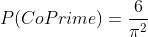
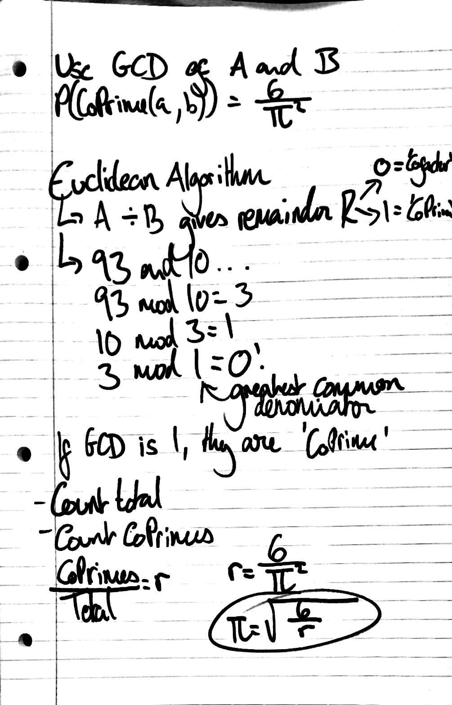

# Pi day 2021
For PI-Day this year, I wanted to take a crack at estimating PI with PI-thon (sorry). To do this, I am using the fact that the probability of two numbers being co-prime is 6 over Pi squared:

My thought process was as follows: 

<i>The Euclidean Algorithm <a href = "https://mathworld.wolfram.com/EuclideanAlgorithm.html">was researched here</a></i>

